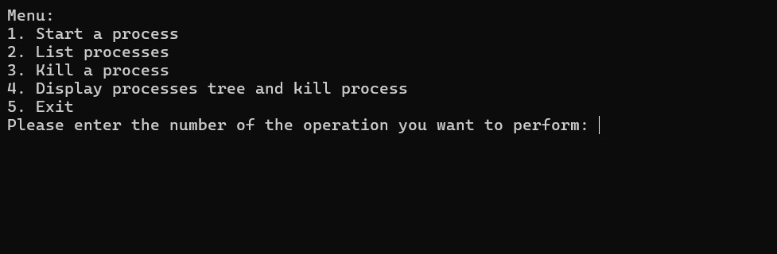

# Process Manager Console

🔄 A C# console application for managing processes on the operating system.

## Description
This C# console application provides a simple interface for managing processes on the operating system. It allows users to start new processes, list running processes, terminate processes, and display processes in a hierarchical tree-like structure for easy visualization.

## Features
- **Start Process:** Start a new process by providing its name.
- **List Processes:** View a list of all running processes with their process IDs and parent process IDs.
- **Kill Process:** Terminate a process by specifying its process ID.
- **Display Processes Tree:** View processes in a hierarchical tree structure for easy visualization.

## Usage
1. Clone the repository.
2. Open the project in Visual Studio or any other C# IDE.
3. Build and run the application.
4. Follow the on-screen instructions to interact with the process manager.

## Screenshots
- Add screenshots of your application here if needed.

## Technologies Used
- C#
- .NET Framework
- System.Diagnostics namespace
- System.Management namespace

## Author
[Your Name]

## License
This project is licensed under the [MIT License](LICENSE).
